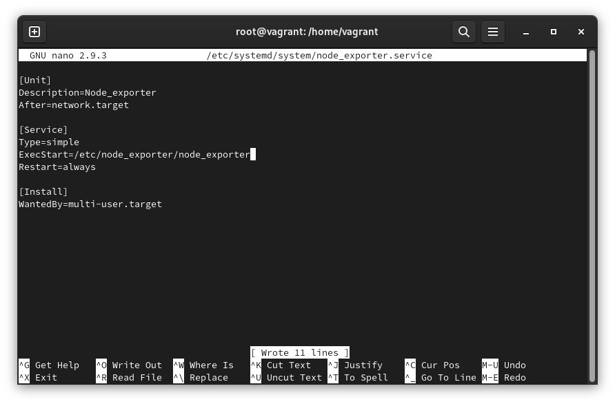
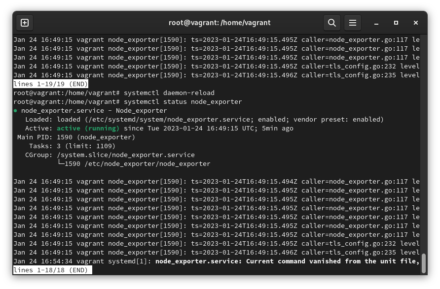
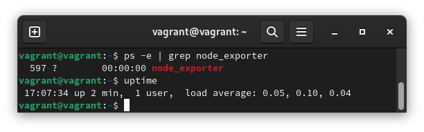
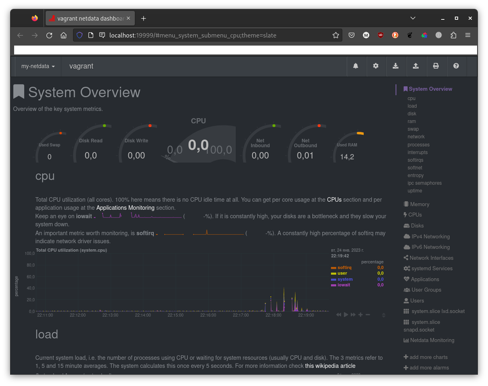
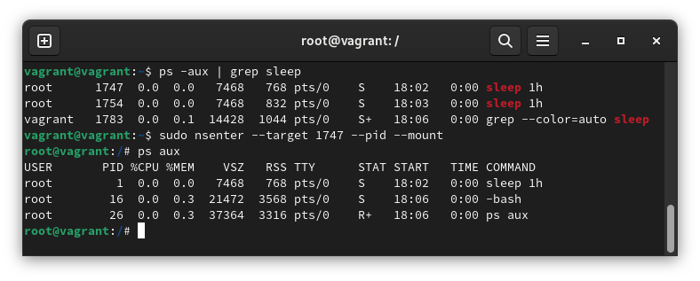
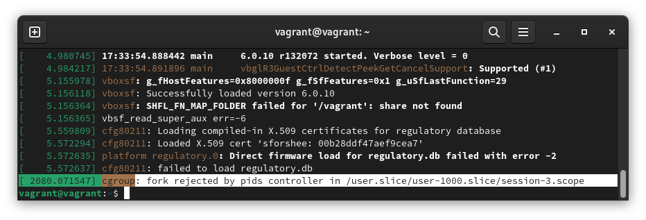
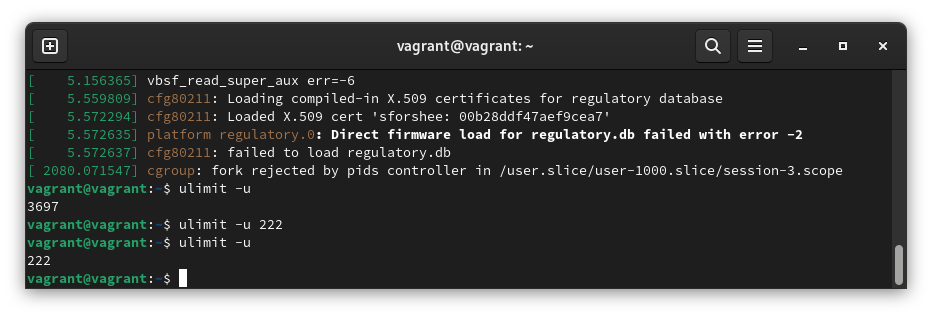

# 03-sysadmin-04-os

### 1. 
>поместите его в автозагрузку

- systemctl enable node_exporter
- systemctl start node_exporter

Странно, но не стартовало с type=notify. Висело на активации сервиса, но сервис работал (curl-ом проверял).

>Предусмотрите возможность добавления опций к запускаемому процессу через внешний файл

ExecStart=/etc/node_exporter/node_exporter $OPTIONS

>Удостоверьтесь, что с помощью systemctl процесс корректно стартует, завершается, а после перезагрузки автоматически поднимается.

### 2. Ознакомьтесь с опциями node_exporter и выводом /metrics по-умолчанию. Приведите несколько опций, которые вы бы выбрали для базового мониторинга хоста по CPU, памяти, диску и сети.

collector.cpu
 
collector.cpufreq
 
collector.meminfo

collector.diskstats

collector.netstat

### 3. Установите в свою виртуальную машину Netdata. Воспользуйтесь готовыми пакетами для установки (sudo apt install -y netdata).

- У текущей версии netdata отсутствует секция [web]

### 4. Можно ли по выводу dmesg понять, осознает ли ОС, что загружена не на настоящем оборудовании, а на системе виртуализации?
Да.

vagrant@vagrant:~$ dmesg | grep Hypervisor

[    0.000000] Hypervisor detected: KVM

### 5. Как настроен sysctl fs.nr_open на системе по-умолчанию? Определите, что означает этот параметр. Какой другой существующий лимит не позволит достичь такого числа (ulimit --help)?
- fs.nr_open - Лимит на максимальное число открываемых файлов

//Soft limit

vagrant@vagrant:~$ ulimit -Sn 

1024

// Hard limit

vagrant@vagrant:~$ ulimit -Hn 

1048576

### 6. Запустите любой долгоживущий процесс (не ls, который отработает мгновенно, а, например, sleep 1h) в отдельном неймспейсе процессов; покажите, что ваш процесс работает под PID 1 через nsenter. Для простоты работайте в данном задании под root (sudo -i). Под обычным пользователем требуются дополнительные опции (--map-root-user) и т.д.

### 7. Найдите информацию о том, что такое :(){ :|:& };:.

- Для предотвращения используем команду ulimit -u. Она выводит количество возможных одновременно запущенных процессов. 

