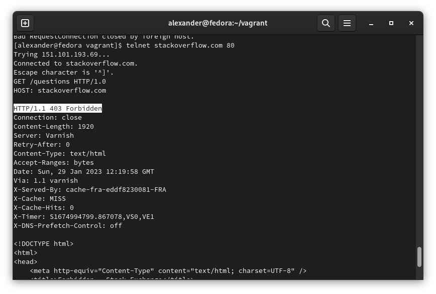
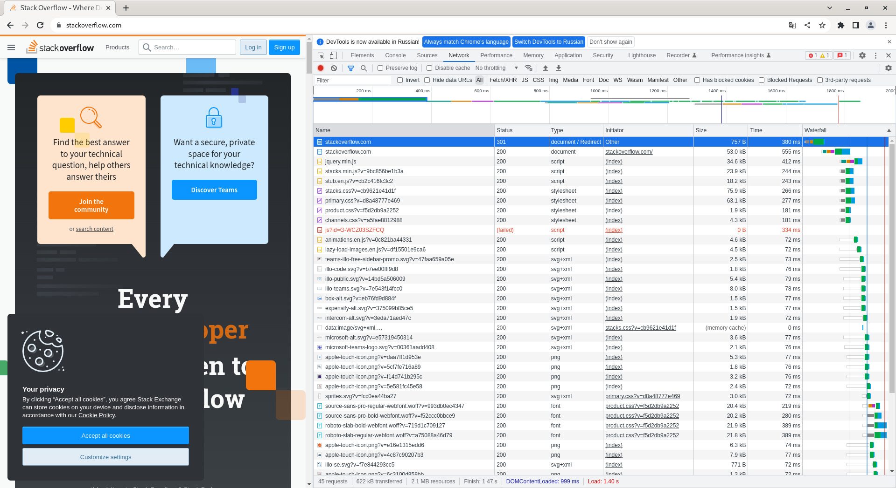
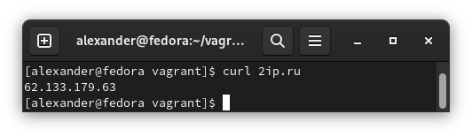
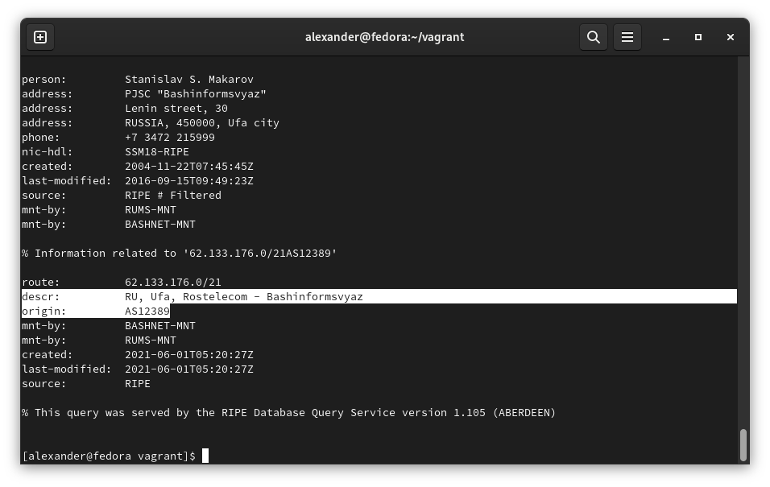
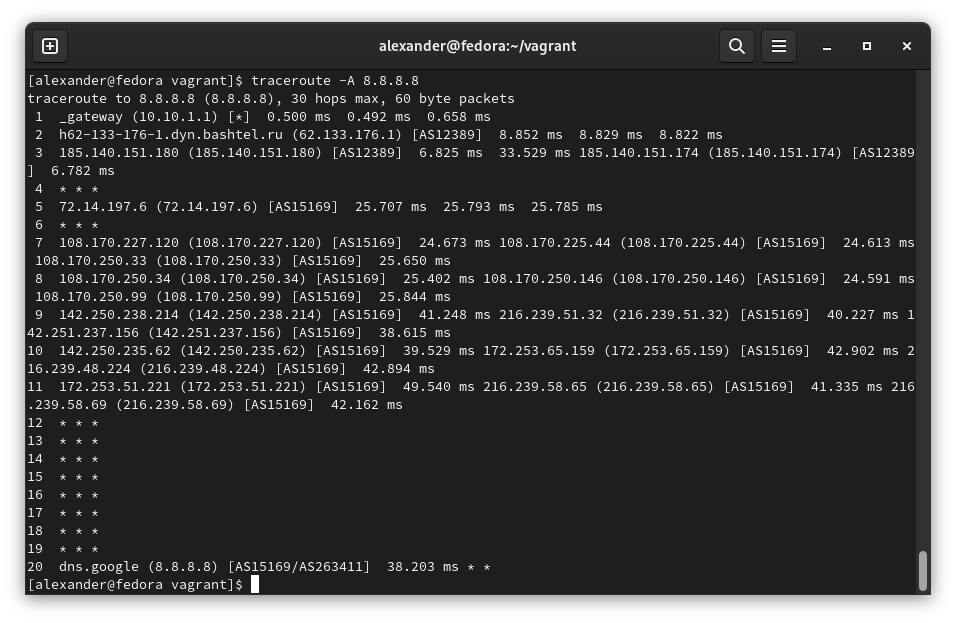
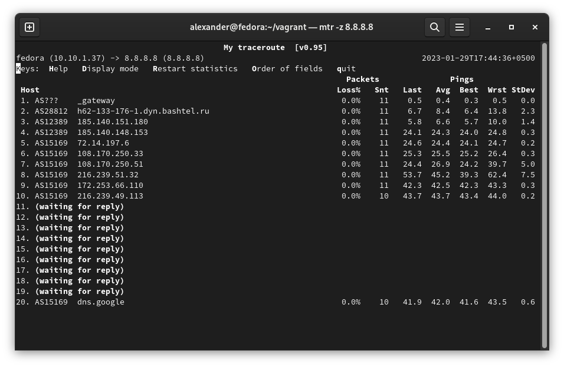
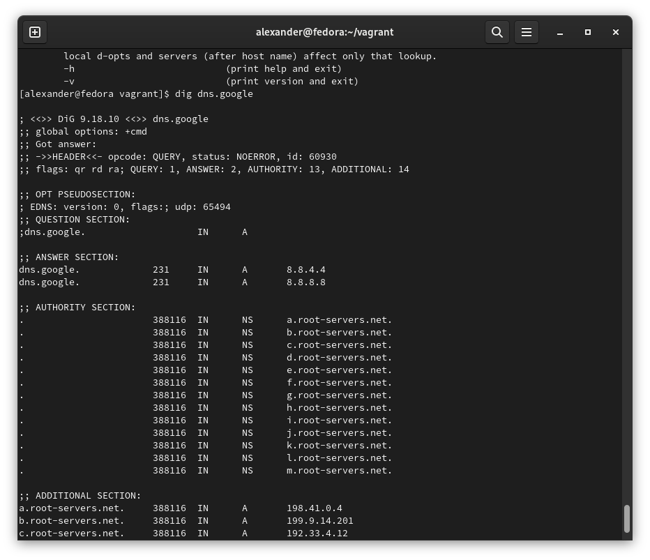
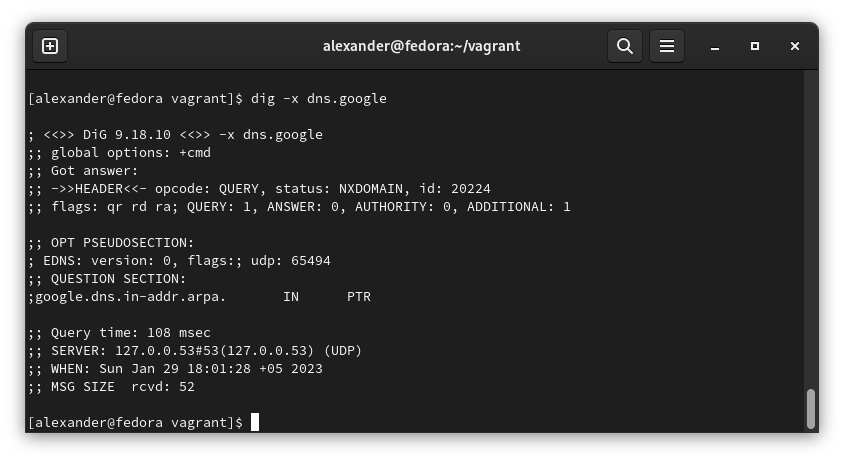

### 1. Работа c HTTP через телнет.
- Подключитесь утилитой телнет к сайту stackoverflow.com 

- telnet stackoverflow.com 80

- Отправьте HTTP запрос

- 403 - доступ запрещён

### 2. Повторите задание 1 в браузере, используя консоль разработчика F12.

- Status Code: 301 Moved Permanently

- Самый длительный запрос: 389мс (вроде бы шрифты подгружал)

В консоли Firefox не отображает редирект.

### 3. Какой IP адрес у вас в интернете?

### 4. Какому провайдеру принадлежит ваш IP адрес? Какой автономной системе AS? Воспользуйтесь утилитой whois.

> Провайдер:          RU, Ufa, Rostelecom - Bashinformsvyaz
> 
> AS:         AS12389

### 5. Через какие сети проходит пакет, отправленный с вашего компьютера на адрес 8.8.8.8? Через какие AS? Воспользуйтесь утилитой traceroute.

> В квадратных скобках - номер AS

### 6. Повторите задание 5 в утилите mtr. На каком участке наибольшая задержка - delay?

> Хоп №8.

### 7. Какие DNS сервера отвечают за доменное имя dns.google? Какие A записи? Воспользуйтесь утилитой dig

### 8. Проверьте PTR записи для IP адресов из задания 7. Какое доменное имя привязано к IP? Воспользуйтесь утилитой dig.

