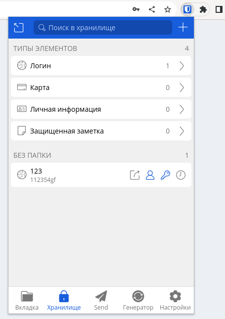

### 1. Установите Bitwarden плагин для браузера. Зарегестрируйтесь и сохраните несколько паролей.

> Я не разделяю удобство подобных систем, ибо это не безопасно (каламбур в лекции о ИБ!)
> 
> Keepass + owncloud/nextcloud on premise = мой выбор.
> 
> У кипаса. кстати, есть браузерный плагин.

-----

### 2. Установите Google authenticator на мобильный телефон. Настройте вход в Bitwarden акаунт через Google authenticator OTP.

-----

### 3. Установите apache2, сгенерируйте самоподписанный сертификат, настройте тестовый сайт для работы по HTTPS.

> yum install httpd

> sudo openssl req -x509 -nodes -days 356 -newkey rsa:2048 -keyout /etc/ssl/private/apache-selfsigned.key

-----

### 4. Проверьте на TLS уязвимости произвольный сайт в интернете (кроме сайтов МВД, ФСБ, МинОбр, НацБанк, РосКосмос, РосАтом, РосНАНО и любых госкомпаний, объектов КИИ, ВПК ... и тому подобное).

> yum install testssl

-----

### 5. Установите на Ubuntu ssh сервер, сгенерируйте новый приватный ключ. Скопируйте свой публичный ключ на другой сервер. Подключитесь к серверу по SSH-ключу.

----
### 6. Переименуйте файлы ключей из задания 5. Настройте файл конфигурации SSH клиента, так чтобы вход на удаленный сервер осуществлялся по имени сервера.

> cd ~/.ssh/
> 
> mv id_rsa id_rsa_0

### 7. Соберите дамп трафика утилитой tcpdump в формате pcap, 100 пакетов. Откройте файл pcap в Wireshark.

