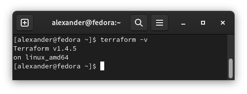

### Задача 1.
>Опишите основные преимущества применения на практике IaaC-паттернов.

- основным преимуществом IaaC является автоматизация развёртывания инфраструктуры

> Какой из принципов IaaC является основополагающим?

- Основополагающим принципом IaaC является создание или настройки инфраструктуры как процесс разработки программного обеспечения.

### Задача 2

>Чем Ansible выгодно отличается от других систем управление конфигурациями?
> 
>Какой, на ваш взгляд, метод работы систем конфигурации более надёжный — push или pull?

1. Использование SSH. Нет необходимости устанавливать клиента для управления (метод Push). Написан на Python
2. Push. Нет необходимости устанавливать клиента для управления

### Задача 3

Установите на личный компьютер:

>VirtualBox,
> 
>Vagrant,
> 
>Terraform,
> 
>Ansible.

Приложите вывод команд установленных версий каждой из программ, оформленный в Markdown.

### Задача 4

Воспроизведите практическую часть лекции самостоятельно.

    Создайте виртуальную машину.
    Зайдите внутрь ВМ, убедитесь, что Docker установлен с помощью команды docker ps

