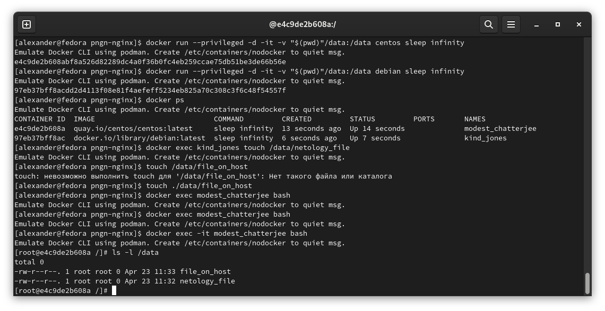

### Задача 1

Сценарий выполнения задачи:

    создайте свой репозиторий на https://hub.docker.com;
    выберите любой образ, который содержит веб-сервер Nginx;
    создайте свой fork образа;
    реализуйте функциональность: запуск веб-сервера в фоне с индекс-страницей, содержащей HTML-код ниже:

````
<html>
<head>
Hey, Netology
</head>
<body>
<h1>I’m DevOps Engineer!</h1>
</body>
</html>
````
Опубликуйте созданный fork в своём репозитории и предоставьте ответ в виде ссылки на https://hub.docker.com/username_repo.

Ответ: https://hub.docker.com/repository/docker/pngn/nginx/

### Задача 2

Посмотрите на сценарий ниже и ответьте на вопрос: «Подходит ли в этом сценарии использование Docker-контейнеров или лучше подойдёт виртуальная машина, физическая машина? Может быть, возможны разные варианты?»

Детально опишите и обоснуйте свой выбор.

> - высоконагруженное монолитное Java веб-приложение;
> 
> Желательно выбрать физику, так как виртуализация будет мешать производительности. Но, если выбор не велик - паравиртуализация.

> - Nodejs веб-приложение;
> 
> Для упрощения обслуживания можно разместить в контейнере (так и будет)

> - мобильное приложение c версиями для Android и iOS;
> 
> Виртуальная машина или физика.

> - шина данных на базе Apache Kafka;
> 
> Можно использовать как контейнеры, так и виртуализацию

> - Elasticsearch-кластер для реализации логирования продуктивного веб-приложения — три ноды elasticsearch, два logstash и две ноды kibana;
> 
> Для нескольких продуктов, есть docker-контейнеры. Можно организовать отказоустойчивое приложение стека ELK.

> - мониторинг-стек на базе Prometheus и Grafana;
>
> Оба собираются контейнерами. Не вижу смысла отдавать им целую виртуальную машину

> - MongoDB как основное хранилище данных для Java-приложения;
> 
> Так как это БД, то лучше всего расположить на виртуальной машине.

> - Gitlab-сервер для реализации CI/CD-процессов и приватный (закрытый) Docker Registry.
> 
> Тоже собирается контейнером, не требует высокой производительности.

### Задача 3

    Запустите первый контейнер из образа centos c любым тегом в фоновом режиме, подключив папку /data из текущей рабочей директории на хостовой машине в /data контейнера.
    Запустите второй контейнер из образа debian в фоновом режиме, подключив папку /data из текущей рабочей директории на хостовой машине в /data контейнера.
    Подключитесь к первому контейнеру с помощью docker exec и создайте текстовый файл любого содержания в /data.
    Добавьте ещё один файл в папку /data на хостовой машине.
    Подключитесь во второй контейнер и отобразите листинг и содержание файлов в /data контейнера.

----
ответ:


