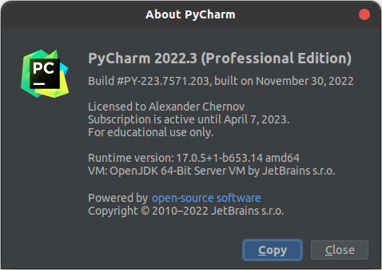
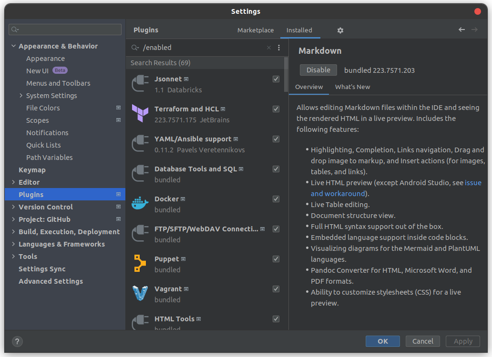

# 1.1. "Введение в DevOps" - Чернов Александр
Задание 1
Установить Py Charm Community Edition - это бесплатная версия IDE.
В качестве альтернативы можно установить Visual Studio Code и дальнейшие шаги проделать с ним. Таким образом вы сможете выбрать для себя более удобный инструмент.

Ответ 1

Задание 2
Установить плагины 
Terraform,
MarkDown,
Yaml/Ansible Support,
Jsonnet.

Ответ 2

Markdown уже был установлен и включен.

Задание 3
Описание жизненного цикла задачи (разработки нового функционала)

Ответ 3

-Еженедельные собрания
-Необходимо оценить этапы разработки
-определить важность задачи. Важные - выше
-Разделить работу на части
-оценка времени выполнения работы
-Обзор каждой части, тестирование
-Обратная связь

new line
